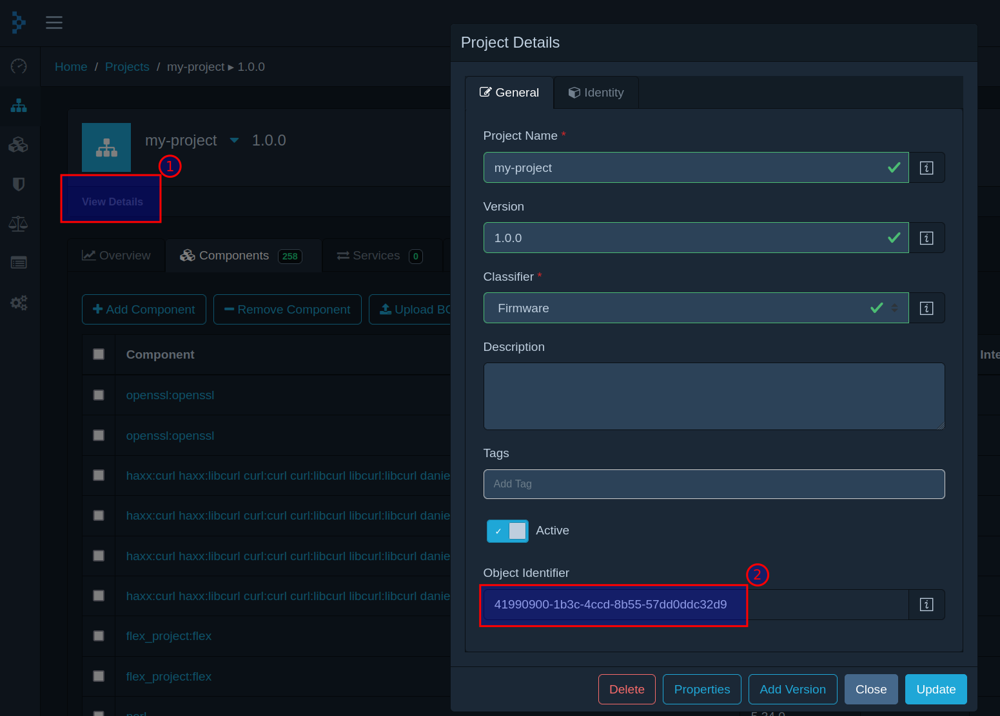
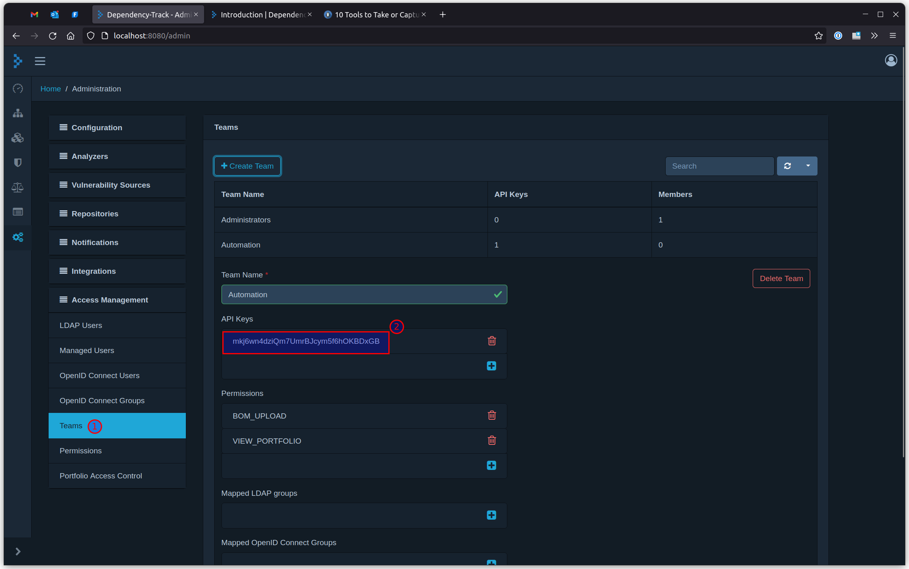

# meta-dependencytrack

`meta-dependencytrack` is a [Yocto](https://www.yoctoproject.org/) meta-layer which produces a [CycloneDX](https://cyclonedx.org/) Software Bill of Materials (aka [SBOM](https://www.ntia.gov/SBOM)) from your root filesystem and then uploads it to a [Dependency-Track](https://dependencytrack.org/) server against the project of your choice.

## Installation

To install this meta-layer simply clone the repository into the `sources` directory and add it to your `build/conf/bblayers.conf` file:

```sh
$ cd sources
$ git clone https://github.com/bgnetworks/meta-dependencytrack.git
```

and in your `bblayers.conf` file:

```sh
BBLAYERS += "${BSPDIR}/sources/meta-dependencytrack"
```

## Configuration

To enable and configure the layer simply inherit the `dependency-track` class in your `local.conf` file and then set the following variables:

* `DEPENDENCYTRACK_PROJECT` - The ID of the project in Dependency-Track
* `DEPENDENCYTRACK_API_URL` - The URL of the Dependency-Track API server. (*Note:* this is usually different from the URL of the web server you use in your browser)
* `DEPENDENCYTRACK_API_KEY` - An authentication key for the server. You can find these in the `Teams` section of the `Adminitration` page in Dependency-Track.

### Example

```sh
DEPENDENCYTRACK_PROJECT = "41990900-1b3c-4ccd-8b55-57dd0ddc32d9"
DEPENDENCYTRACK_API_URL = "http://localhost:8081/api"
DEPENDENCYTRACK_API_KEY = "mkj6wn4dziQm7UmrBJcym5f6hOKBDxGB"
INHERIT += "dependency-track"
```

### Finding your Project ID



### Finding your API Key



## Building and Uploading

Once everything is configured simply build your image as you normally would. The final CycloneDX SBOM is saved as `tmp/deploy/dependency-track/bom.json` and, after buiding is complete, you should be able to simply refresh the project in Dependency Track to see the results of the scan.
